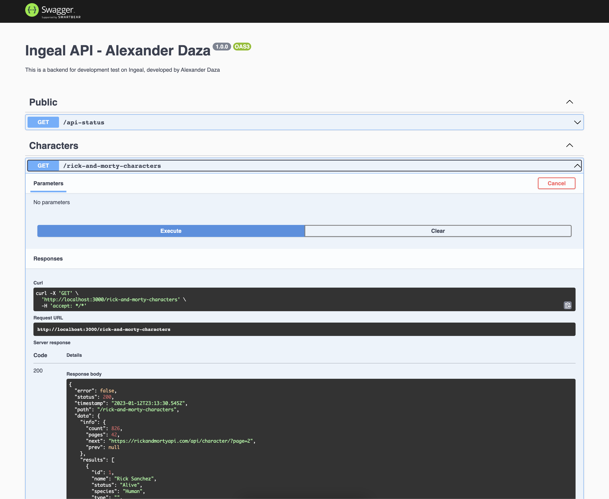

## Description

This is a sample backend application for consume a Rick and Morty API, using NestJS and Swagger documentation for Ingeal

## Tech stack

- [Node.js](https://nodejs.org/en/)
- [Yarn](https://yarnpkg.com/)
- [NestJS](https://nestjs.com/)
- [TypeScript](https://www.typescriptlang.org/)
- [Swagger](https://swagger.io/)

## After run the Ingeal API

After running this API, you can access to Swagger documentation in the next URL: http://localhost:3000/documentation. Please use Swagger for test this API and play with it.

<p align="center">
  <a href="#"></a>
</p>

This API has the next endpoints:

- GET /api-status
- GET /rick-and-morty-characters
- GET /rick-and-morty-character/:id
- GET /rick-and-morty-characters-filtered

## Installation

```bash
# This project use yarn as package manager
$ yarn
```

## Build API to production

```bash
# Build API
$ yarn build

# Build Common Library
$ yarn run build:lib:common
```

## Running the Ingeal API

```bash
# development
$ yarn run start

# watch mode
$ yarn run start:dev

# production mode
$ yarn run start:prod
```

## Test

```bash
# unit tests
$ yarn run test

# e2e tests
$ yarn run test:e2e

# test coverage
$ yarn run test:cov
```

## Stay in touch

- Author - [Alexander Daza](https://www.alexanderdaza.com)
- E-Mail - [dev.alexander.daza@gmail.com](mailto:dev.alexander.daza@gmail.com)
- Github - [https://github.com/devalexanderdaza](https://github.com/devalexanderdaza)
